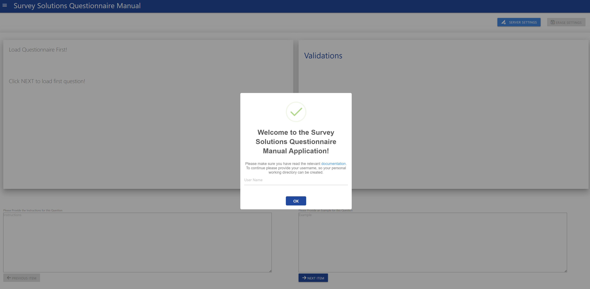
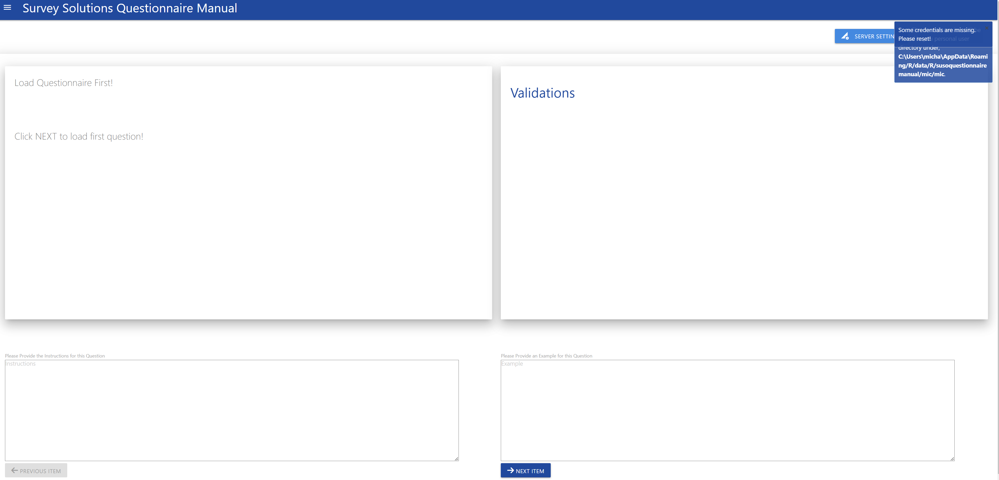
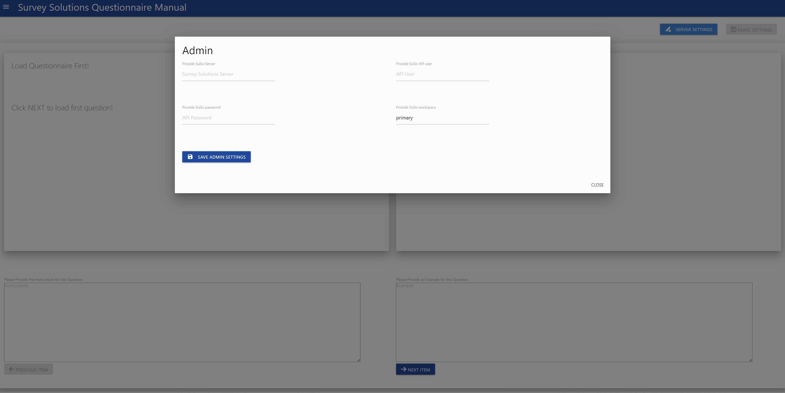
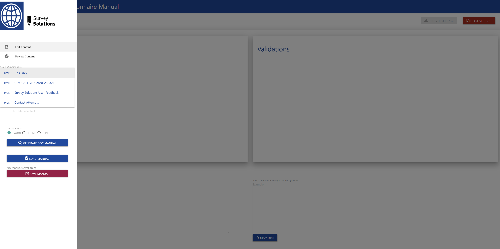
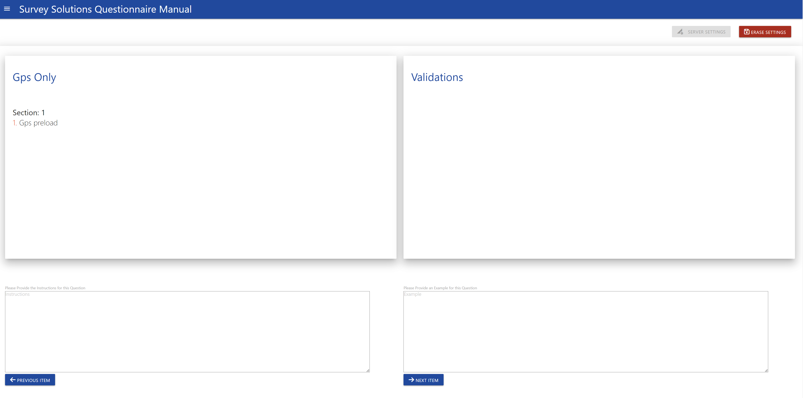
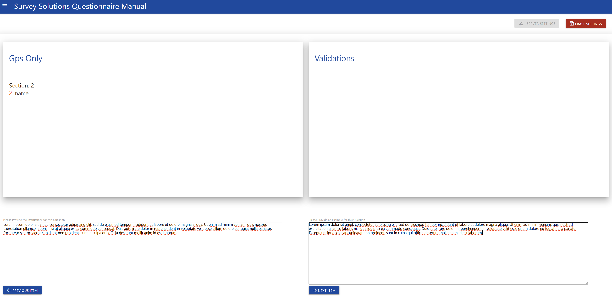
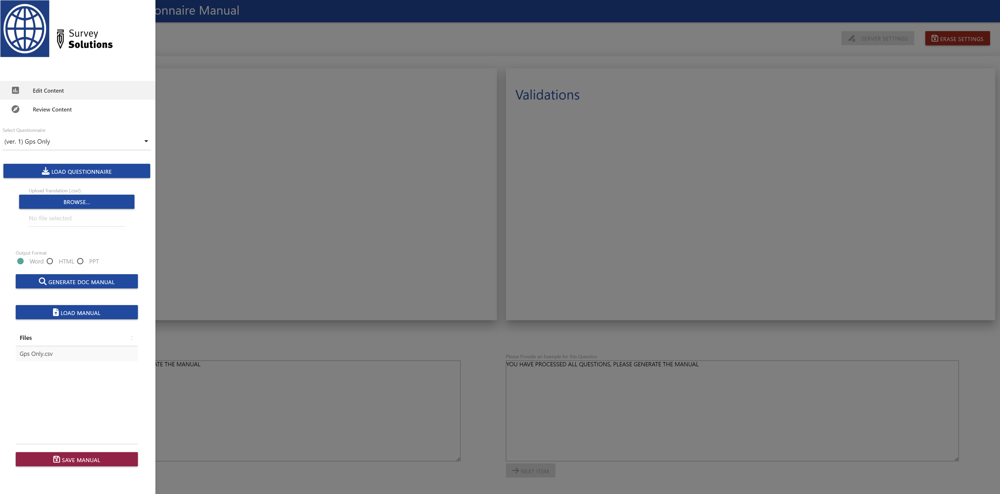
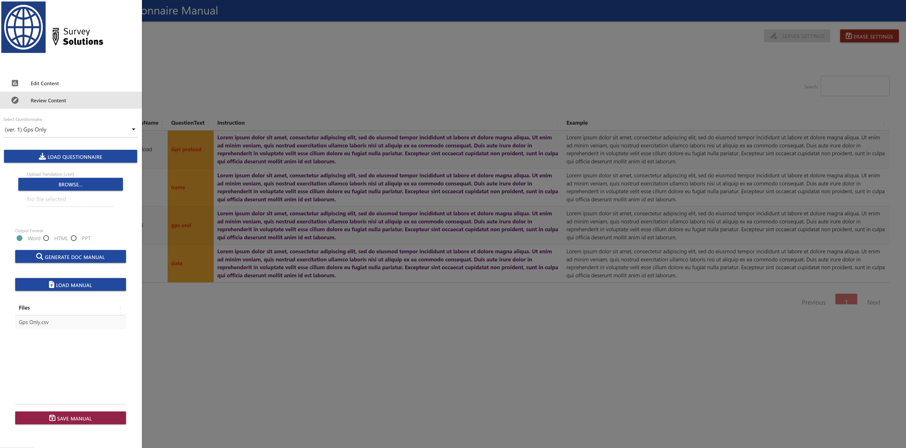
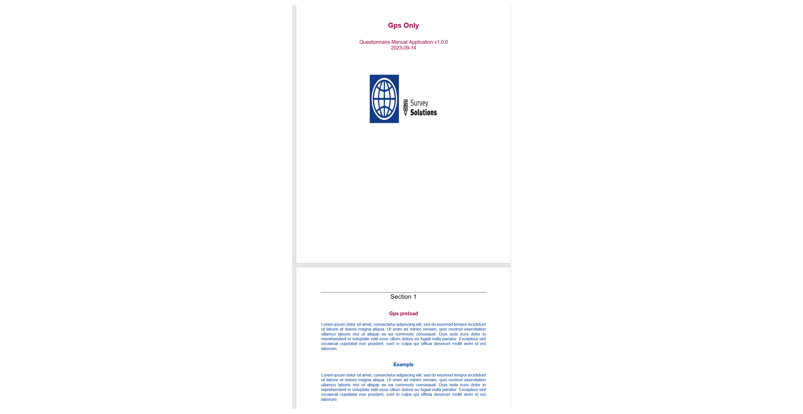
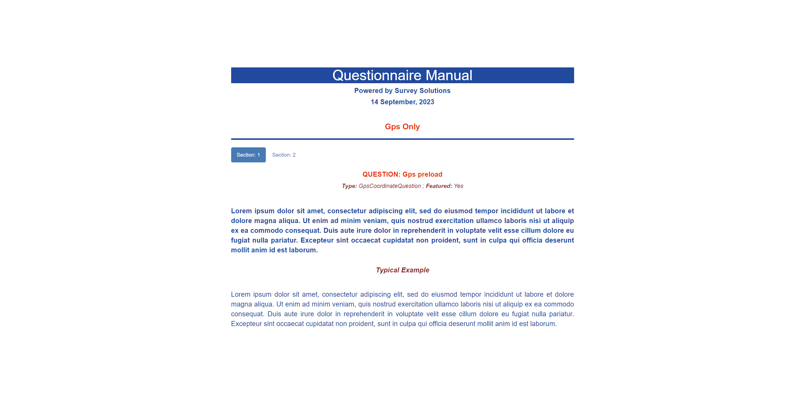

```{r, include = FALSE}
knitr::opts_chunk$set(
  collapse = TRUE, 
  tidy=TRUE,
  comment = "#>",
  eval=FALSE, echo=TRUE,
  out.width = "50%"
)
```

```{css, echo=FALSE}
.figcaption {
  text-align: center;
}

p {
  text-align: justify !important;
}

```


## Running the application

After successful installation of the susoquestionnairemanual package, you just need to run the following two commands to start the application:


```{r setup}
library(susoquestionnairemanual)
runParaApp()

```


This will start the application in your default browser.

## Using the application

After running above commands, your browser will show the following start-up dialogue:


{width=100%}


Provide you user name, so your personal working directory can be created on your system.This will store the admin as well as questionnaire/manual data. After providing the name, a notification in the tip right corner will tell you its full path. When ever you connect with this user, all prior data will be loaded into the application.

{width=100%}

After that the system will check for any credentials in your working directory if none are present, then you have to provide them by clicking the **Server Settings** button in the upper right corner, which will open the following popup window:


{width=100%}

Saving the credentials will start the credentials check, and if no error appears, your credentials will be stored and you can close the window. A further indicator for a successful connection is also the **Erase Settings** button in the upper right corner, which will only be active if valid credentials had been provided.

### Selecting the questionnaire


Now you can select the questionnaire you want to work with. After selection click the **Load Questionnaire** button.


{width=100%}


When the questionnaire is loaded, You will see its title in the main window. Click on **Next Item** to see the first question. In case you want to upload a translation you should ideally do it now.


{width=100%}

Continue providing the relevant Instructions and Examples you want to include. In case there are validations attached to a question, it will also be shown on the screen, in the **Validations** box


{width=100%}

After you reach the end of the questionnaire, the application will tell. You can now go to the review section and review all your inputs. This is also a good occasion to save the questionnaire manual inputs.


Saving the manual will display a table above the button **Save Manual**, with all your stored manuals.


{width=100%}


After the review you can either continue making changes, or generate the manual in the available format, i.e HTML, PPTX, or DOC. If a translation was provided, then the manual will be in the language of the translation, otherwise the language used in your questionnaire.


{width=100%}


Depending on your use case you can either choose a word document, which you may give to interviewers for the training:

{width=100%}


A power point presentation which may also be useful for training purposes:

{width=100%}


Or a html document, which can be embedded in a website or put on the interviewer tablet:


{width=100%}


We hope this tool is useful! As always feedback is appreciated and welcome.


